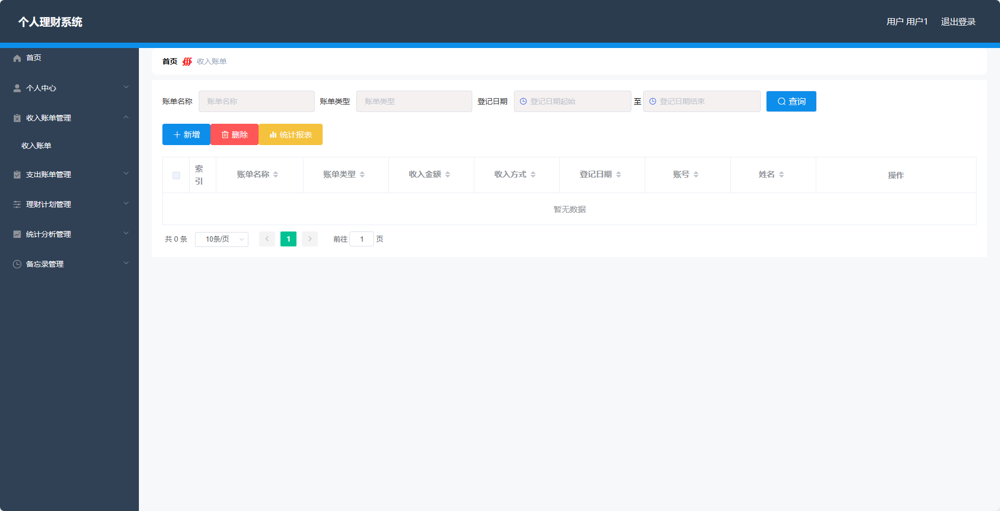
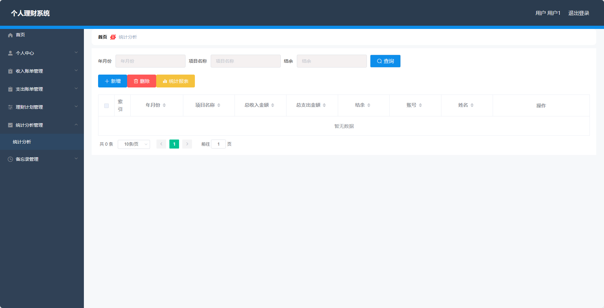

<h1 align="center">基于SpringBoot框架实现的个人理财系统【带文档】</h1>

 获取sql文件 QQ: 3645296857 QQ群: 978300347 

<h4> 需要视频演示可联系上述QQ，私发视频链接 </h4>

 获取更多高质量源码，请访问：[mzoo源码网](https://mzoocodes.com/)

## 简介

> 本代码来源于网络,仅供学习参考使用!
>
> <b style="color: dodgerblue"> 提供1.远程部署/2.修改代码/3.定制程序/4.文档指导/5.框架代码讲解、技术解答、代码讲解等服务 </b>
>
> 前端地址：http://localhost:8080/springbootm47gb/admin/dist/index.html
>
> 管理员: admin 密码: 123456
> 
> 用户：用户1 密码：123456
>

## 项目介绍

基于SpringBoot框架实现的个人理财系统【带文档】：前端 vue、axios、elementui，后端 springboot、mybatis，系统角色分为：管理员和用户，管理员在管理后台用户信息、账单类型等；用户可以查看自己的收支情况、备忘录信息、理财计划等。主要功能如下：

### 管理员

- 个人中心：管理员可以在个人中心查看和修改自己的个人信息。
- 用户管理：管理员可以对用户进行管理，包括添加新用户、编辑用户信息、删除用户以及查看用户列表。
- 账单类型管理：管理员可以管理账单类型，包括添加新的账单类型、编辑账单类型信息、删除账单类型以及查看账单类型列表。

### 用户
- 个人中心：用户可以在个人中心查看和修改自己的个人信息。
- 收入账单管理：用户可以添加和管理收入账单，包括记录收入的金额、时间、来源等信息，查看、编辑和删除已记录的收入账单。
- 支出账单管理：用户可以添加和管理支出账单，包括记录支出的金额、时间、用途等信息，查看、编辑和删除已记录的支出账单。
- 理财计划管理：用户可以制定和管理理财计划，包括设定目标、计划时间、计划金额等信息，查看、编辑和删除已设定的理财计划。
- 统计分析管理：用户可以查看自己的收入和支出情况的统计分析结果。
- 备忘录管理：用户可以添加、编辑和删除备忘录。

## 环境

- <b>IntelliJ IDEA 2020.3</b>

- <b>Mysql 5.7.26</b>

- <b>Maven 3.6.3</b>

- <b>JDK 1.8</b>

## 运行截图

